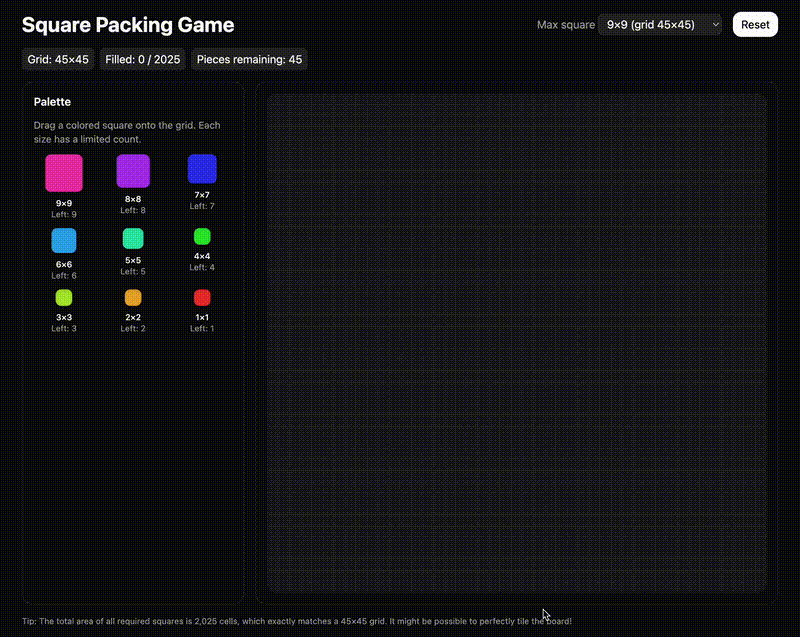
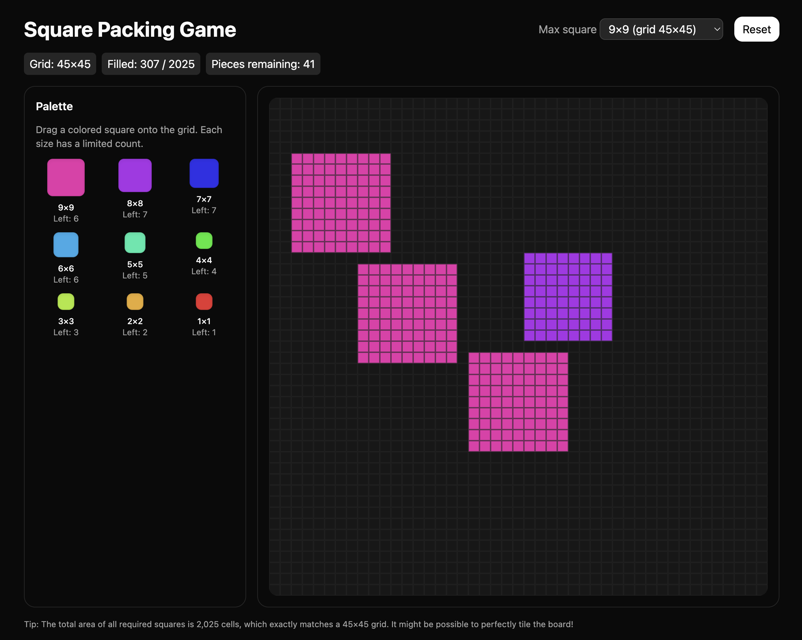

# Square Packing Game

A drag-and-drop puzzle where you perfectly tile a square grid using smaller squares of sizes 1×1 up to N×N, with exactly N copies of the N×N piece, (N-1) copies of the (N-1)×(N-1) piece, …, and 1 copy of the 1×1 piece.

- [](https://vabs.github.io/square-packing-game/)
- Tech: React + TypeScript + Vite + Tailwind CSS

## Objective
Fill the entire grid without overlaps or gaps. The grid is of size G×G where G = N(N+1)/2. The total area of all squares exactly equals the grid area, so a perfect tiling is possible.

## Features
- Drag-and-drop placement onto a responsive grid
- Palette with remaining piece counts per size
- Hover preview with validity indicator (solid for valid, red diagonal for invalid)
- Right-click a placed piece to remove it
- Drag an already placed piece to reposition it
- Adjustable maximum size N (changes grid and available pieces)
- Stats for grid size, filled cells, and remaining pieces
- Celebration confetti and toast when you perfectly tile the grid
- Reset button to start over

## Controls
- Drag a piece from the Palette onto the grid to place it.
- Right-click on a placed piece to remove it.
- Drag a placed piece to move it; drop to place, or release outside to cancel.
- Use the “Max square” selector to change N.
- Click “Reset” to clear the board.

## How it works
- Max size: `N` (default 9)
- Grid size: `G = N(N+1)/2` (so for N=9, G=45 and the grid is 45×45)
- Available pieces: sizes 1..N with exactly `size` copies available per size
- Placement is permitted only if the target region is empty and fully within bounds

## Demo (GIF)



## Screenshot



## Local development

Requirements:
- Node.js 18+ (recommended) and npm

Install dependencies and start the dev server:

```bash
npm install
npm run dev
```

Then open the URL printed by Vite (typically http://localhost:5173/).

## Build

```bash
npm run build
```
The production build will be output to `dist/`.

## Deploy (GitHub Pages)
This project is configured to deploy to GitHub Pages using `gh-pages` and the `homepage` value in `package.json`.

- Pre-deploy build:
```bash
npm run predeploy
```
- Publish the `dist` folder to the `gh-pages` branch:
```bash
npm run deploy
```
Make sure your repository is public and GitHub Pages is set to serve from the `gh-pages` branch (if needed, GitHub will manage this automatically for the `gh-pages` branch).

## Project structure
```
public/
  solutions/            # (optional) assets or saved solutions
src/
  App.tsx               # App shell
  SquarePackingGame.tsx # Main game component
  index.css             # Tailwind styles
  main.tsx              # React/Vite entry
index.html
vite.config.ts
```

## License
MIT
